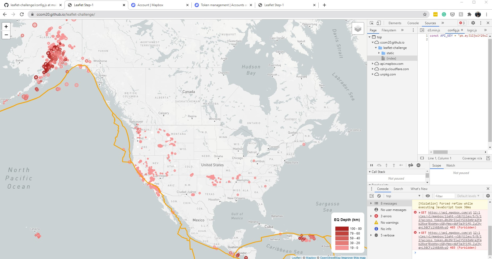
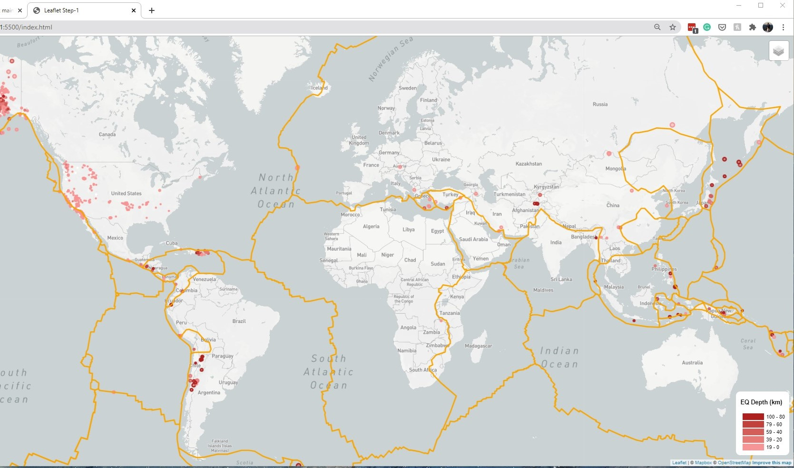

# Geo Mapping Earthquakes and Plates

This project looks at the occurance of earthquakes and plots their location accordingly. Additionally, the user has the option to change the style and graph appearing on the map. 

### Running on GitHub Pages

### Running Locally

